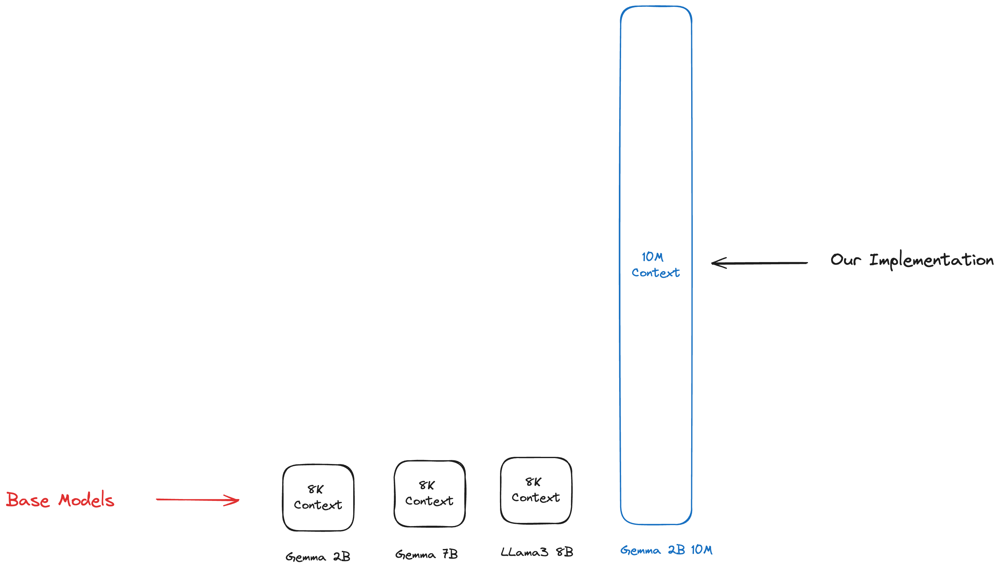

# Gemma 2B - 10M Context

Gemma 2B with recurrent local attention with context length of up to 10M. Our implemenation uses **<32GB** of memory!



**Features:**

- 10M sequence length on Gemma 2B.
- Runs on less than 32GB of memory.
- Native inference optimized for cuda.
- Recurrent local attention for O(N) memory.

## Quick Start

> **Note:** This is a very early checkpoint of the model. Only 200 steps. We plan on training for a lot more tokens!

Install the requirements:

```bash
pip install -r requirements.txt
```

Install the model from huggingface - [Huggingface Model](https://huggingface.co/mustafaaljadery/gemma-10M-safetensor).

```bash
python main.py
```

Change the `main.py` inference code to the specific prompt you desire.

```python
model_path = "./models/gemma-2b-10m"
tokenizer = AutoTokenizer.from_pretrained(model_path)
model = GemmaForCausalLM.from_pretrained(
    model_path,
    torch_dtype=torch.bfloat16
)

prompt_text = "Summarize this harry potter book..."

with torch.no_grad():
    generated_text = generate(
        model, tokenizer, prompt_text, max_length=512, temperature=0.8
    )

    print(generated_text)
```

## How does this work?

The largest bottleneck (in terms of memory) for LLMs is the KV cache. It grows quadratically in vanilla multi-head attention, thus limiting the size of your sequence length.

Our approach splits the attention in local attention blocks as outlined by [InfiniAttention](https://arxiv.org/abs/2404.07143). We take those local attention blocks and apply recurrance to the local attention blocks for the final result of 10M context global atention.

A lot of the inspiration for our ideas comes from the [Transformer-XL](https://arxiv.org/abs/1901.02860) paper.

## More details
For more context about our motivations, implementation details, and the theory behind the work, check out our technical overview on [medium](https://medium.com/@akshgarg_36829/gemma-10m-technical-overview-900adc4fbeeb). 

## Credits

This was built by:

- [Mustafa Aljadery](https://www.maxaljadery.com/)
- [Siddharth Sharma](https://stanford.edu/~sidshr/)
- [Aksh Garg](https://www.linkedin.com/in/aksh-garg/)
